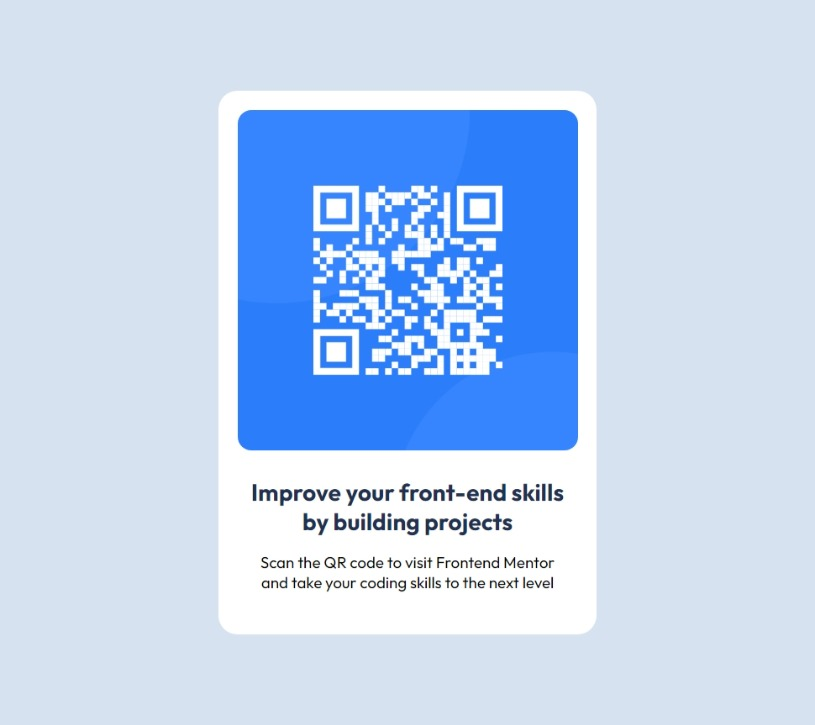

# Frontend Mentor - QR code component solution

This is a solution to the [QR code component challenge on Frontend Mentor](https://www.frontendmentor.io/challenges/qr-code-component-iux_sIO_H). Frontend Mentor challenges help you improve your coding skills by building realistic projects. 

## Table of contents

- [Overview](#overview)
  - [Screenshot](#screenshot)
  - [Links](#links)
- [My process](#my-process)
  - [Built with](#built-with)
  - [What I learned](#what-i-learned)
  - [Continued development](#continued-development)
  - [Useful resources](#useful-resources)
- [Author](#author)
- [Acknowledgments](#acknowledgments)

## Overview

### Screenshot




### Links

- Solution URL: [Add solution URL here](https://your-solution-url.com)
- Live Site URL: [Add live site URL here](https://your-live-site-url.com)

## My process

### Built with

- Semantic HTML5 markup
- CSS custom properties
- Flexbox

### What I learned

It was an exciting and really simple project. The HTML markup was really simple. Most of the challenges i faced came from the styling while using CSS. Alot of padding was needed to make it look similar to the design. I also had to tweak the borders abit to give them the round edge look. I used mainly flexbox for most of the display properties so that it could the minimum height.

```css
body{
    min-height: 100vh;
    display: flex;
    align-items: center;
}

.card{
    padding: 18px;
    border-radius: 18px;
}
```

### Continued development

Looking towards the future i would really like to continue my development by gaining more knowlegde on CSS concepts like flexbox and grid and the different instances they can be used to give my projects   structures more stability. Queries are also a point of interest.  

### Useful resources

- [Example resource 1](https://www.youtube.com) - This helped me in setting up my git and github environments so i could push my solutions. 

## Author

- Website - [LOIC CHECK](https://www.your-site.com)
- Frontend Mentor - [@NDZIE444](https://www.frontendmentor.io/profile/ndzie444)

## Acknowledgments

Would like to acknowledge my mentor Mr M. Sederick for his relentless guidance and putting me through to this wonderful platform.
